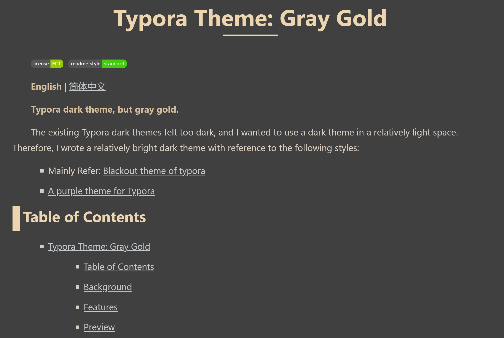
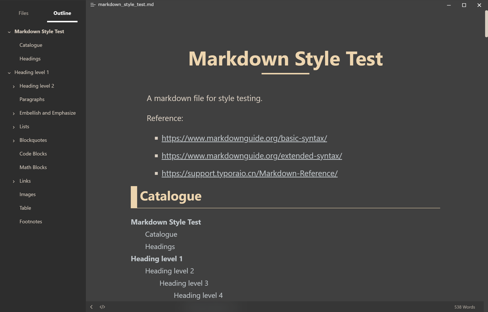
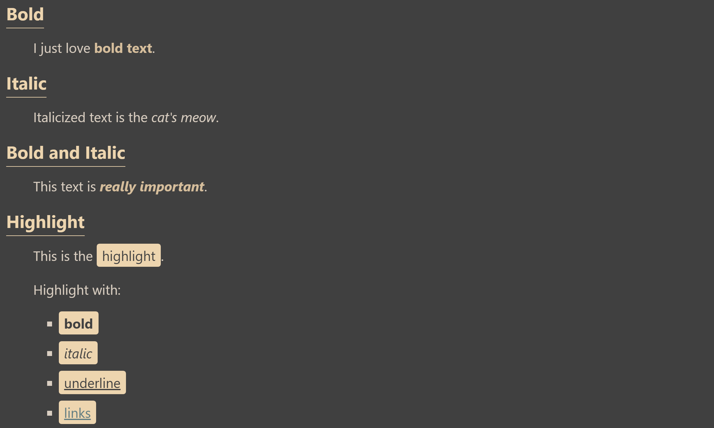
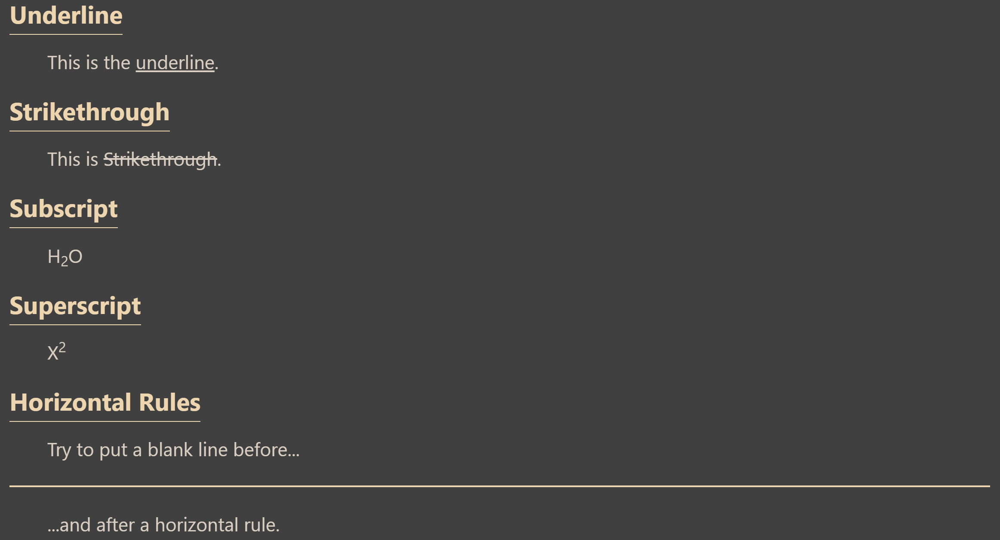
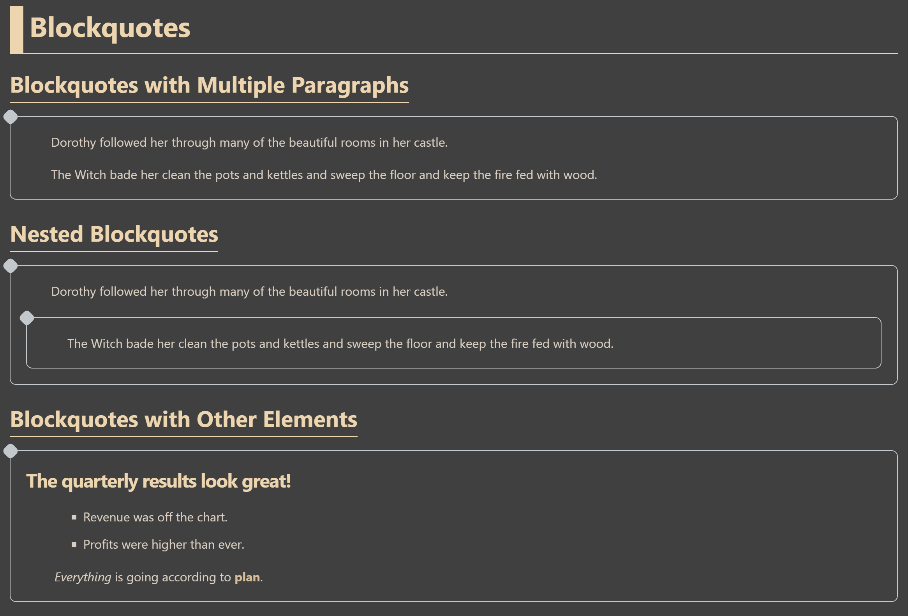
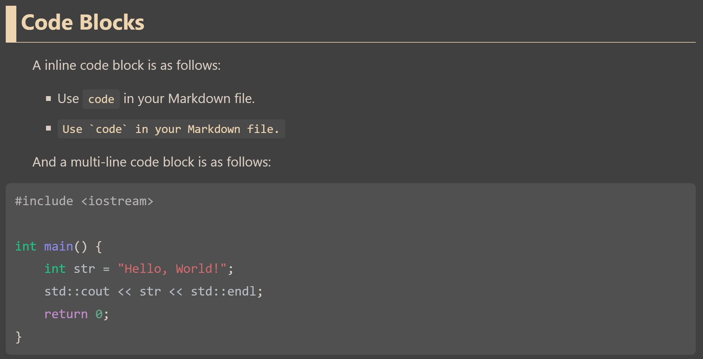
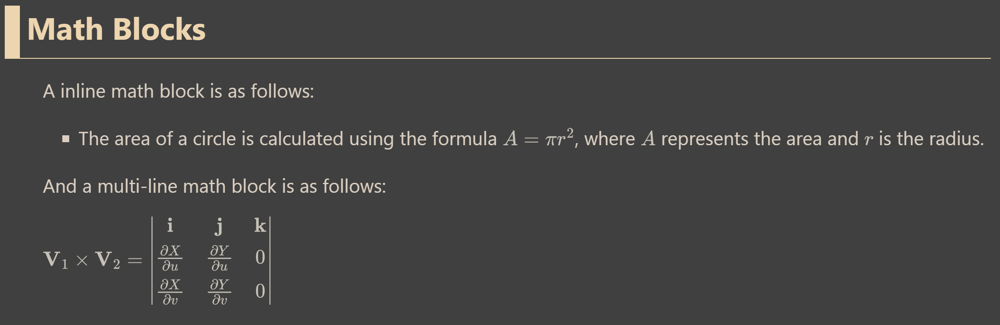
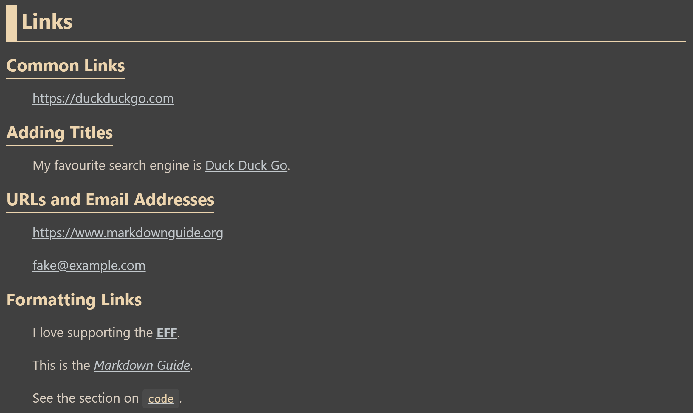
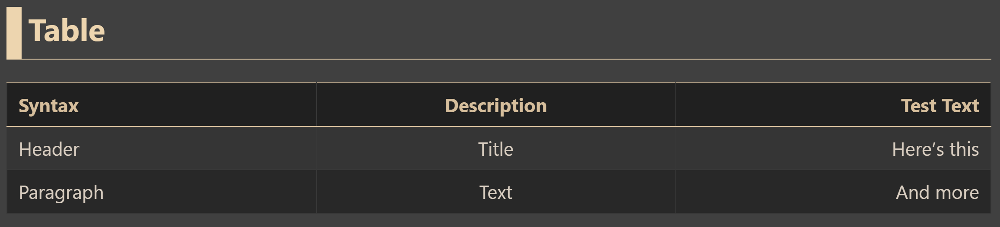
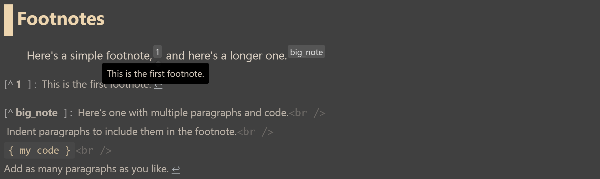

# Typora Theme: Gray Gold

    

**English** | ~~[简体中文]()~~

**Typora dark theme, but gray gold.** 

The existing Typora dark themes felt too dark, and I wanted to use a dark theme in a relatively light space. Therefore, I wrote a relatively bright dark theme with reference to the following styles:
- Mainly Refer: [Blackout theme of typora](https://github.com/obscurefreeman/typora_theme_blackout?tab=readme-ov-file)
- [A purple theme for Typora](https://github.com/hliu202/typora-purple-theme/tree/master)

## Table of Contents

- [Typora Theme: Gray Gold](#typora-theme-gray-gold)
  - [Table of Contents](#table-of-contents)
  - [Background](#background)
  - [Features](#features)
  - [Preview](#preview)
    - [Overview](#overview)
    - [Title](#title)
    - [Text](#text)
    - [List](#list)
    - [Table](#table)
    - [Block](#block)
  - [Install](#install)
  - [Usage](#usage)
  - [Custom](#custom)
    - [base.css](#basecss)
    - [base.control.css](#basecontrolcss)
    - [My Variables](#my-variables)
  - [TODO](#todo)
  - [Maintainers](#maintainers)
  - [Contributing](#contributing)
    - [Contributors](#contributors)
  - [License](#license)

## Background

The existing dark mode styles typically have at least one of the following characteristics:

- **Background Too Dark**

  It is not suitable for use in relatively bright environments. When the screen is too dark under normal indoor lighting conditions, the contrast and brightness difference between the screen and the surroundings become too large, leading to visual fatigue.

  As for why dark mode is used in bright environments, it is because dark mode can reduce the overall screen brightness and protect the eyes without compromising usability.

- **High Color Contrast**

  This can cause increased eye fatigue, such as using highly saturated bright colors with deep black.

- **Monotonous Colors and Simple Styles**

  This is just a matter of personal taste.

To address the above issues, I have designed a relatively bright dark mode color scheme that incorporates richer yet simple style designs while ensuring visual comfort.

---

现有的黑暗模式样式主要有以下至少一个特征：

- **背景太黑**

  不适于在相对明亮的地方使用。在正常室内光线强度下，过黑也会导致屏幕和环境的对比度和亮度差距过大，这会导致视觉疲劳。

  至于为什么要在明亮的地方使用黑暗模式，这是因为黑暗模式可以减少屏幕整体亮度，能够在不影响使用的前提下保护眼睛。

- **配色对比度太强**

  这会导致眼睛更容易疲劳，比如高饱和度的亮色配合深黑色。

- **颜色过于单调，样式比较朴素**

  这只是我个人的口味。

为了解决上述问题，我设计了一个相对明亮的黑暗模式配色，在保证视觉舒适的前提下加入了更丰富但简洁的样式设计。

## Features

- **Relatively light-colored dark theme, suitable for use in relatively bright indoor environments**

  This mode is suitable for use in environments with strong lighting. Its background color is relatively light, making it more suitable for use in bright indoor settings.

- **Visually friendly color scheme, avoiding high-contrast visual stimulation**

  I have adopted a visually friendly color scheme that avoids high-contrast visual stimulation. The chosen color scheme is more subtle, reducing eye strain.

- **Relatively rich yet simple style design**

  I prioritize a style design that is both rich and simple. This allows for visual appeal without overwhelming the user with excessive distractions.

---

- **相对浅色的黑暗主题，可以在室内相对明亮的地方使用**

  这种模式适用于光线较强的环境中使用。它的背景色相对较浅，更适合在明亮的室内环境下使用。

- **视觉友好的配色，拒绝高对比度的视觉刺激**

  我采用了视觉友好的配色方案，避免了高对比度的视觉刺激。配色方案的选择更加柔和，减少了眼睛的负担。

- **相对丰富但简洁的样式设计**

  我注重样式设计的丰富性，同时保持简洁的风格。这样可以在保持视觉吸引力的同时，不会给用户带来过多的干扰。

## Preview

The example file is the [markdown_style_test.md](markdown_style_test.md).

### Overview

### Headings

### Embellish and Emphasize

### Lists

- Ordered Lists

  

- Unordered Lists

  

- Task Lists

  

### Blockquotes

### Code Blocks

### Math Blocks

### Links

### Table

### Images

### Footnotes

## Install

~~[Download]()~~

Reference:
- [Install Theme](https://theme.typora.io/doc/Install-Theme/).

> Summary
> 1. Open Theme Folder from Preference Panel → Appearance section.
> 2. Copy css and related resources（the `gray_gold.css` and the `gray_gold` folder), like fonts or images, into the newly opened folder.
> 3. Restart typora, then select it from Themes menu.

## Usage

Note: You may need to manually go to this repository to obtain and update the latest styles (maybe I will release a more complete version in the future), so you may need to track the progress of this project. :star::heavy_check_mark:

## Custom

TODO

### base.css

### base.control.css

### My Variables

## TODO

- [ ] Improve README
- [ ] Adjust the style of source code mode
- [ ] Adjust the style of code blocks.(Maybe Ref: [对程序员友好的 Typora 主题](https://github.com/lb-fes/typora-theme))
- [ ] Refactor my garbage code ；；
- [ ] Commit to [Typora Themes](https://theme.typora.io/)

## Maintainers

[@UmyNya#ΦωΦ](https://github.com/UmyNya)

## Contributing

Feel free to dive in! [Open an issue](https://github.com/UmyNya/typora-theme-gray-gold/issues/new) or submit PRs.

Typora Theme: Gray Gold follows the [Contributor Covenant](http://contributor-covenant.org/version/1/3/0/) Code of Conduct.

Small note: 
- If commit, please conform to the [Conventional Commits 1.0.0](https://www.conventionalcommits.org/en/v1.0.0/) specification.
- If editing the README, please conform to the [standard-readme](https://github.com/RichardLitt/standard-readme) specification.

### Contributors

This project exists thanks to all the people who contribute.

~~See [the contributing file](CONTRIBUTING.md)!~~

## License

[MIT License](./LICENSE) © UmyNya#ΦωΦ
